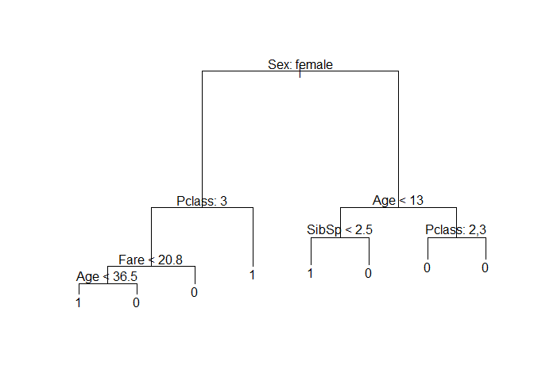
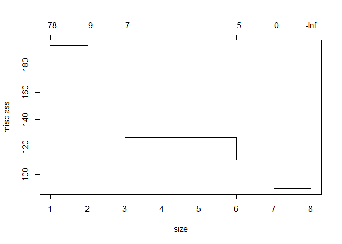
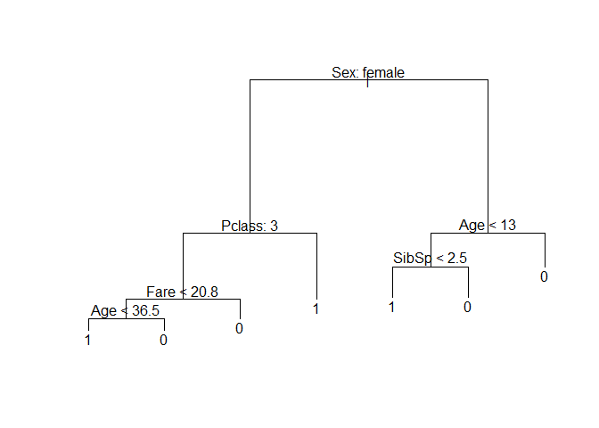
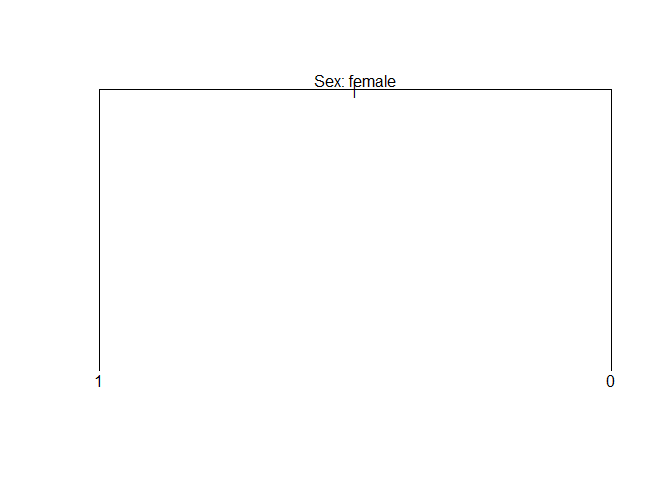
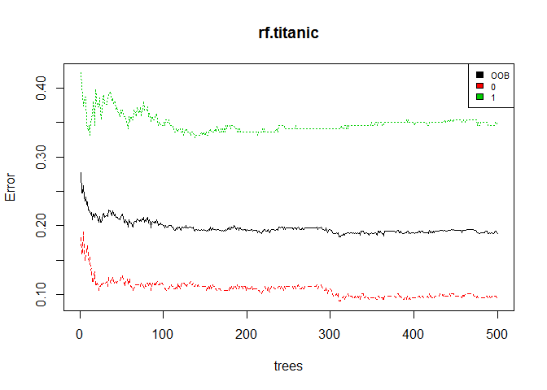
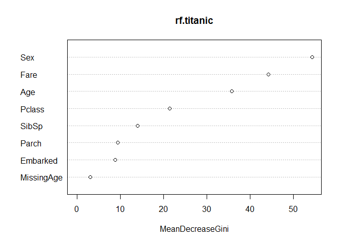

Kaggle Titanic Competition: First Attempt
-----------------------------------------

This was my first attempt at Kaggle's `Titanic: Machine Learning from Disaster` competion (see <https://www.kaggle.com/c/titanic>). The titanic data set consists of information about the passengers (no crew) including age, gender, class of ticket, and several other variables. The data includes a training set of 891 passengers for whom we know which ones survive and the goal was to predict which of the remaining 418 passengers survived.

### A Look at the Data

``` {.r}
rm(list = ls())
```

Let us first set up and examine the training data.

``` {.r}
titanic = read.table("train.csv", sep=",", header=T, na.strings="NA")
names(titanic)
```

    ##  [1] "PassengerId" "Survived"    "Pclass"      "Name"        "Sex"        
    ##  [6] "Age"         "SibSp"       "Parch"       "Ticket"      "Fare"       
    ## [11] "Cabin"       "Embarked"

``` {.r}
summary(titanic)
```

    ##   PassengerId       Survived          Pclass     
    ##  Min.   :  1.0   Min.   :0.0000   Min.   :1.000  
    ##  1st Qu.:223.5   1st Qu.:0.0000   1st Qu.:2.000  
    ##  Median :446.0   Median :0.0000   Median :3.000  
    ##  Mean   :446.0   Mean   :0.3838   Mean   :2.309  
    ##  3rd Qu.:668.5   3rd Qu.:1.0000   3rd Qu.:3.000  
    ##  Max.   :891.0   Max.   :1.0000   Max.   :3.000  
    ##                                                  
    ##                                     Name         Sex           Age       
    ##  Abbing, Mr. Anthony                  :  1   female:314   Min.   : 0.42  
    ##  Abbott, Mr. Rossmore Edward          :  1   male  :577   1st Qu.:20.12  
    ##  Abbott, Mrs. Stanton (Rosa Hunt)     :  1                Median :28.00  
    ##  Abelson, Mr. Samuel                  :  1                Mean   :29.70  
    ##  Abelson, Mrs. Samuel (Hannah Wizosky):  1                3rd Qu.:38.00  
    ##  Adahl, Mr. Mauritz Nils Martin       :  1                Max.   :80.00  
    ##  (Other)                              :885                NA's   :177    
    ##      SibSp           Parch             Ticket         Fare       
    ##  Min.   :0.000   Min.   :0.0000   1601    :  7   Min.   :  0.00  
    ##  1st Qu.:0.000   1st Qu.:0.0000   347082  :  7   1st Qu.:  7.91  
    ##  Median :0.000   Median :0.0000   CA. 2343:  7   Median : 14.45  
    ##  Mean   :0.523   Mean   :0.3816   3101295 :  6   Mean   : 32.20  
    ##  3rd Qu.:1.000   3rd Qu.:0.0000   347088  :  6   3rd Qu.: 31.00  
    ##  Max.   :8.000   Max.   :6.0000   CA 2144 :  6   Max.   :512.33  
    ##                                   (Other) :852                   
    ##          Cabin     Embarked
    ##             :687    :  2   
    ##  B96 B98    :  4   C:168   
    ##  C23 C25 C27:  4   Q: 77   
    ##  G6         :  4   S:644   
    ##  C22 C26    :  3           
    ##  D          :  3           
    ##  (Other)    :186

The variables `Pclass` and `Survived` are really categorical variable so we would like R to recognize them as such.

``` {.r}
titanic$Pclass = as.factor(titanic$Pclass)
titanic$Survived = as.factor(titanic$Survived)
```

In this first attempt, we will keep things as simple as possible and assess model accuracy using a validation set. For exact replicability, we will set a fixed seed.

``` {.r}
nrow(titanic)
```

    ## [1] 891

``` {.r}
set.seed(37)
train = sample(1:nrow(titanic), 600)
```

Let us load packages for trees and random forests.

``` {.r}
require(tree)
require(randomForest)
```

### First Tree Model

We start by fitting a simple tree to the data: The variable `PassengerId` is simply an index for the data so we will not include it as a predictor. The variables `Name`, `Ticket`, and `Cabin` could be relevant but for simplicity we will omit them from our model as well. (Note: `Name` and `Ticket` are probably correlated with the variables `SibSp`, then number of siblings/spouses onboard, and `Parch`, the number of parents/children onboard.)

``` {.r}
tree.titanic = tree(Survived~.-PassengerId-Name-Ticket-Cabin, data=titanic[train, ])
plot(tree.titanic)
text(tree.titanic, pretty=0)
```

<!-- -->

This simple model has the advantage of being very intepretable. We see that female passengers who were wealthier (ticket class 1 or 2) or younger (under 40 years old) were likely to survive, while male passengers (with the exception of children with few relatives onboard) were much less likely to survive.

Note that wealth seems to have been a important factor for males as well. Consider the two leaves furthest to the right (corresponding to males 13 years or older). Even though our model predicts that the passengers satisfying the conditions of both leaves do no survive, the fact that there is a split indicates that one node has higher purity than the other.

``` {.r}
nrow(subset(titanic[train, ], Sex=="male" & Age >= 13 & Pclass == 1 & Survived == 1))/nrow(subset(titanic[train, ], Sex=="male" & Age >=13 & Pclass == 1)) # 1st class
```

    ## [1] 0.3648649

``` {.r}
nrow(subset(titanic[train, ], Sex=="male" & Age >= 13 & Pclass != 1 & Survived == 1))/nrow(subset(titanic[train, ], Sex=="male" & Age >= 13 & Pclass != 1)) # 2nd & 3rd class
```

    ## [1] 0.125

Indeed, the survival rate for those in 1st class is 0.3649 compared to 0.125 for those in 2nd and 3rd class.

We are probably overfitting the data. We will address this later, first by considering pruned trees and then by looking at a random forest model. However, let's first check how our tree model does on the test set:

``` {.r}
tree.pred = predict(tree.titanic, titanic[-train, ], type="class")
tree.predtable = with(titanic[-train,], table(tree.pred, Survived)); tree.predtable
```

    ##          Survived
    ## tree.pred   0   1
    ##         0 155  29
    ##         1  17  90

``` {.r}
(tree.predtable[1,1]+tree.predtable[2,2])/nrow(titanic[-train,])
```

    ## [1] 0.8419244

On our validation set, the tree model has accuracy 0.8419. For comparison, let us look at the majority class classifier.

``` {.r}
summary(titanic[-train,]$Survived);
```

    ##   0   1 
    ## 172 119

``` {.r}
majority = max(sum(titanic[-train,]$Survived == 1), sum(titanic[-train,]$Survived == 0))
majority/nrow(titanic[-train,])
```

    ## [1] 0.5910653

Most of the passengers in our validations set do no survive. A model which simply predicts that no passengers survive at all yields an accuracy of 0.5911 on the validation set.

### An Even Simpler Tree

What about a pruned tree?

``` {.r}
cv.titanic = cv.tree(tree.titanic, FUN=prune.misclass)
cv.titanic
```

    ## $size
    ## [1] 8 7 6 3 2 1
    ## 
    ## $dev
    ## [1]  93  90 111 127 123 194
    ## 
    ## $k
    ## [1] -Inf    0    5    7    9   78
    ## 
    ## $method
    ## [1] "misclass"
    ## 
    ## attr(,"class")
    ## [1] "prune"         "tree.sequence"

``` {.r}
plot(cv.titanic)
```

<!-- -->

It seems that we might slightly improve our results by pruning the tree to have 7 leaves instead of 8.

``` {.r}
prune.titanic7 = prune.misclass(tree.titanic, best=7)
plot(prune.titanic7); text(prune.titanic7, pretty=0)
```

<!-- -->

In fact just in terms of prediction, this is the same model as before. We have simply merged two nodes, exchanging nuance (wealth is also a factor for male passengers) for a simpler model.

Looking at the plot comparing trees of different sizes, we see that we may expect a big accuracy gain going from a tree of size 1 to a tree of size 2 (a stump) then no real change until we get to sizes 6, 7, and 8. Let us consider the stump.

``` {.r}
prune.titanic2 = prune.misclass(tree.titanic, best=2)
plot(prune.titanic2); text(prune.titanic2, pretty=0)
```

<!-- -->

This model gives one very simple rule: Female passengers survive, male passengers do not. We have sacrificed the nuances due to age and wealth and in exchange we have gotten a model which can be completely explained in a single sentence.

Let us see how well this model does on our validation set.

``` {.r}
prune.pred = predict(prune.titanic2, titanic[-train, ], type="class")
with(titanic[-train,], table(prune.pred, Survived))
```

    ##           Survived
    ## prune.pred   0   1
    ##          0 146  26
    ##          1  26  93

``` {.r}
(146+93)/nrow(titanic[-train,])
```

    ## [1] 0.8213058

The accuracy rate of 0.8213 is not much lower than the rate of 0.8419 for the larger tree and certainly better than the rate of 0.5911 for the majority class classifier.

### A Random Forest Model

Now let's try with a random forest. Using the data as is, we immediately run into a problem.

``` {.r}
rf.titanic = randomForest(Survived~.-PassengerId-Name-Ticket-Cabin, data=titanic[train, ])
```

    ## Error in na.fail.default(structure(list(Survived = structure(c(2L, 1L, : missing values in object

By default, `tree` handles missing automaticallt by dropping further down the tree to make a decision. For `randomForest`, we need to impute the missing data. We will do this directly ourselves.

Let us first determine for which variables we are missing data.

``` {.r}
names(titanic)
```

    ##  [1] "PassengerId" "Survived"    "Pclass"      "Name"        "Sex"        
    ##  [6] "Age"         "SibSp"       "Parch"       "Ticket"      "Fare"       
    ## [11] "Cabin"       "Embarked"

``` {.r}
for(i in c(3,5,6,7,8,10,12)){
  print(names(titanic)[i])
  print(sum(is.na(titanic[i])))
}
```

    ## [1] "Pclass"
    ## [1] 0
    ## [1] "Sex"
    ## [1] 0
    ## [1] "Age"
    ## [1] 177
    ## [1] "SibSp"
    ## [1] 0
    ## [1] "Parch"
    ## [1] 0
    ## [1] "Fare"
    ## [1] 0
    ## [1] "Embarked"
    ## [1] 0

Thus, we must impute values for `Age` in order to use `randomForest` to build a random forest model. There are enough missing values that we do not want to discard the corresponding data. The next easiest thing would be to replace all the missing values with the average age of the remaining passengers. However, it seems likely that the survival rate of the passengers whose age is unknown is different from that of those passengers whose age is known. For example, in our first tree we saw that wealth (in the form of `Pclass`) was an important factor. It is not unreasonable to believe there might be correlation between a passenger's wealth and the likelihood of knowing that passenger's age.

``` {.r}
with(titanic[train, ], sum(Survived == 1))/length(train) #all
```

    ## [1] 0.3716667

``` {.r}
with(titanic[train, ], sum(!is.na(Age) & Survived == 1))/with(titanic[train, ], sum(!is.na(Age))) # age unknown
```

    ## [1] 0.4016563

``` {.r}
with(titanic[train, ], sum(is.na(Age) & Survived == 1))/with(titanic[train, ], sum(is.na(Age))) # age unknown
```

    ## [1] 0.2478632

The surival rate for all passengers in the training data (excluding the validation set) is 0.3717. However, if we restrict to those whose age is missing, this drops to 0.2479.

To try and deal with this discrepancy, let us introduce a new variable `MissingAge` indicating whether or not the passenger's age was missing.

``` {.r}
MissingAge = ifelse(is.na(titanic$Age), "Yes", "No")
titanic2 = data.frame(titanic, MissingAge)
```

Having included this new variable, we will now assign the average age of the passengers (including the validation set) to all those passengers whose age is missing.

``` {.r}
meanAge = mean(titanic2[MissingAge == "No", ]$Age); meanAge
```

    ## [1] 29.69912

``` {.r}
titanic2[MissingAge == "Yes", ]$Age = meanAge
```

We are now ready to build a random forest.

``` {.r}
rf.titanic = randomForest(Survived~.-PassengerId-Name-Ticket-Cabin, data=titanic2[train, ])
rf.titanic
```

    ## 
    ## Call:
    ##  randomForest(formula = Survived ~ . - PassengerId - Name - Ticket -      Cabin, data = titanic2[train, ]) 
    ##                Type of random forest: classification
    ##                      Number of trees: 500
    ## No. of variables tried at each split: 2
    ## 
    ##         OOB estimate of  error rate: 18.83%
    ## Confusion matrix:
    ##     0   1 class.error
    ## 0 341  36  0.09549072
    ## 1  77 146  0.34529148

``` {.r}
plot(rf.titanic)
legend("topright", colnames(rf.titanic$err.rate), cex = 0.7, col=1:3, fill = 1:3)
```

<!-- -->

The out-of-bag (OOB) error is of roughly the same magnitute as the validation set error for our two tree models. It seems that our random forest model is more likely to misclassify passengers who do survive than those who don't.

Let's check on the validation set.

``` {.r}
rf.pred = predict(rf.titanic, titanic2[-train, ])
with(titanic2[-train,], table(rf.pred, Survived))
```

    ##        Survived
    ## rf.pred   0   1
    ##       0 161  34
    ##       1  11  85

``` {.r}
(162 + 84)/nrow(titanic2[-train, ])
```

    ## [1] 0.8453608

The accuracy rate is 0.8454 which is slightly better than those of our tree models, but it is not clear if this difference is meaningful.

Now let's see which variables were important in the model.

``` {.r}
varImpPlot(rf.titanic)
```

<!-- -->

It seems our `MissingAge` predictor was used, but was among the least important.

### Making Predictions

Now let us make predictions on the test data using the random forest model.

We first need to tell R to treat `Pclass` as a categorical variable and add a `MissingAge` variable to the test set.

``` {.r}
test = read.table("test.csv", sep=",", header=T, na.strings="NA")
test$Pclass = as.factor(test$Pclass)
MissingAge = ifelse(is.na(test$Age), "Yes", "No")
test2 = data.frame(test, MissingAge)
```

To impute the age we will use the average age from the whole data set (both training and test).

``` {.r}
meanAge2 = mean(test2[MissingAge == "No", ]$Age)
meanAgeFull = (meanAge*nrow(titanic2[MissingAge == "No", ]) + meanAge2*nrow(test2[MissingAge == "No", ]))/(nrow(titanic2[MissingAge == "No", ]) + nrow(test2[MissingAge == "No", ])); meanAgeFull
```

    ## [1] 29.88184

``` {.r}
test2[MissingAge == "Yes", ]$Age = meanAgeFull
```

One more difficulty arises when making predictions. In our training data, `Age` was the only variable with missing data.

``` {.r}
names(test2)
```

    ##  [1] "PassengerId" "Pclass"      "Name"        "Sex"         "Age"        
    ##  [6] "SibSp"       "Parch"       "Ticket"      "Fare"        "Cabin"      
    ## [11] "Embarked"    "MissingAge"

``` {.r}
for(i in c(2,4,5,6,7,9,11,12)){
  print(names(test2)[i])
  print(sum(is.na(test2[i])))
}
```

    ## [1] "Pclass"
    ## [1] 0
    ## [1] "Sex"
    ## [1] 0
    ## [1] "Age"
    ## [1] 0
    ## [1] "SibSp"
    ## [1] 0
    ## [1] "Parch"
    ## [1] 0
    ## [1] "Fare"
    ## [1] 1
    ## [1] "Embarked"
    ## [1] 0
    ## [1] "MissingAge"
    ## [1] 0

There is one passenger whose fare is unknown.

``` {.r}
test2[is.na(test2$Fare), ]
```

    ##     PassengerId Pclass               Name  Sex  Age SibSp Parch Ticket
    ## 153        1044      3 Storey, Mr. Thomas male 60.5     0     0   3701
    ##     Fare Cabin Embarked MissingAge
    ## 153   NA              S         No

We will impute this value by assigning the average fare for fares of the same class.

``` {.r}
avg_3rd_class = mean(test2[test2$Pclass == 3 & !is.na(test2$Fare), ]$Fare); avg_3rd_class
```

    ## [1] 12.45968

``` {.r}
test2[is.na(test2$Fare), ]$Fare = avg_3rd_class
```

If we try and make predictions using our model, we get an error:

``` {.r}
rf.pred_test = predict(rf.titanic, newdata=test2)
```

    ## Error in predict.randomForest(rf.titanic, newdata = test2): Type of predictors in new data do not match that of the training data.

The problem is that some categorical variables in the test data have different levels than those in the training set

``` {.r}
names(titanic2)
```

    ##  [1] "PassengerId" "Survived"    "Pclass"      "Name"        "Sex"        
    ##  [6] "Age"         "SibSp"       "Parch"       "Ticket"      "Fare"       
    ## [11] "Cabin"       "Embarked"    "MissingAge"

The variable `Embarked` seems most likely to account for the discrepancy, but let's check all the categorical variables in our model.

``` {.r}
setequal(levels(titanic2$Pclass),levels(test2$Pclass))
```

    ## [1] TRUE

``` {.r}
setequal(levels(titanic2$Sex), levels(test2$Sex))
```

    ## [1] TRUE

``` {.r}
setequal(levels(titanic2$Embarked), levels(test2$Embarked))
```

    ## [1] FALSE

``` {.r}
setequal(levels(titanic2$MissingAge), levels(test2$MissingAge))
```

    ## [1] TRUE

Indeed, `Embarked` was the problem, which we can quickly fix.

``` {.r}
levels(test2$Embarked) = levels(titanic2$Embarked)
```

Now, we are finally ready to make predictions.

``` {.r}
rf.pred_test = predict(rf.titanic, newdata=test2)
rf.pred_test
```

    ##   1   2   3   4   5   6   7   8   9  10  11  12  13  14  15  16  17  18 
    ##   0   0   0   0   1   0   1   0   1   0   0   0   1   0   1   1   0   0 
    ##  19  20  21  22  23  24  25  26  27  28  29  30  31  32  33  34  35  36 
    ##   1   0   0   0   1   0   1   0   1   0   0   0   0   0   1   0   0   0 
    ##  37  38  39  40  41  42  43  44  45  46  47  48  49  50  51  52  53  54 
    ##   1   1   0   0   0   0   0   1   1   0   0   0   1   0   0   0   1   1 
    ##  55  56  57  58  59  60  61  62  63  64  65  66  67  68  69  70  71  72 
    ##   0   0   0   0   0   1   0   0   0   1   1   1   1   0   0   1   1   0 
    ##  73  74  75  76  77  78  79  80  81  82  83  84  85  86  87  88  89  90 
    ##   1   0   1   0   0   1   0   1   1   0   0   0   0   0   1   1   0   1 
    ##  91  92  93  94  95  96  97  98  99 100 101 102 103 104 105 106 107 108 
    ##   1   0   1   0   0   0   1   0   1   0   1   0   0   0   0   0   0   0 
    ## 109 110 111 112 113 114 115 116 117 118 119 120 121 122 123 124 125 126 
    ##   0   0   0   0   1   1   1   0   0   1   0   1   1   0   1   0   0   1 
    ## 127 128 129 130 131 132 133 134 135 136 137 138 139 140 141 142 143 144 
    ##   0   1   0   0   0   0   0   0   0   0   0   0   1   0   0   1   0   0 
    ## 145 146 147 148 149 150 151 152 153 154 155 156 157 158 159 160 161 162 
    ##   0   0   0   0   0   0   1   0   0   1   0   0   1   1   0   1   0   1 
    ## 163 164 165 166 167 168 169 170 171 172 173 174 175 176 177 178 179 180 
    ##   1   0   0   1   0   0   1   1   0   0   0   0   0   1   1   0   1   1 
    ## 181 182 183 184 185 186 187 188 189 190 191 192 193 194 195 196 197 198 
    ##   0   1   1   0   1   0   1   0   0   0   0   0   0   0   1   0   1   1 
    ## 199 200 201 202 203 204 205 206 207 208 209 210 211 212 213 214 215 216 
    ##   0   1   0   1   1   1   0   0   0   0   1   0   0   0   0   1   0   0 
    ## 217 218 219 220 221 222 223 224 225 226 227 228 229 230 231 232 233 234 
    ##   0   0   1   0   1   0   1   0   1   0   0   0   0   0   0   1   0   0 
    ## 235 236 237 238 239 240 241 242 243 244 245 246 247 248 249 250 251 252 
    ##   0   0   0   0   1   1   1   1   0   0   0   0   1   0   1   1   1   0 
    ## 253 254 255 256 257 258 259 260 261 262 263 264 265 266 267 268 269 270 
    ##   1   0   0   0   0   0   1   0   0   0   1   1   0   0   0   0   1   0 
    ## 271 272 273 274 275 276 277 278 279 280 281 282 283 284 285 286 287 288 
    ##   0   0   1   1   0   1   0   0   0   0   1   1   0   1   1   0   0   0 
    ## 289 290 291 292 293 294 295 296 297 298 299 300 301 302 303 304 305 306 
    ##   0   0   0   0   0   0   0   0   1   0   0   0   0   0   0   0   0   1 
    ## 307 308 309 310 311 312 313 314 315 316 317 318 319 320 321 322 323 324 
    ##   1   0   0   0   0   0   0   0   1   1   1   0   0   0   0   0   0   0 
    ## 325 326 327 328 329 330 331 332 333 334 335 336 337 338 339 340 341 342 
    ##   1   0   1   0   0   0   1   0   0   1   0   0   0   0   0   0   0   0 
    ## 343 344 345 346 347 348 349 350 351 352 353 354 355 356 357 358 359 360 
    ##   0   1   0   1   0   0   0   1   1   0   0   0   1   0   1   0   0   1 
    ## 361 362 363 364 365 366 367 368 369 370 371 372 373 374 375 376 377 378 
    ##   0   1   1   0   1   0   0   1   1   0   0   1   0   0   1   1   1   0 
    ## 379 380 381 382 383 384 385 386 387 388 389 390 391 392 393 394 395 396 
    ##   0   0   0   0   1   1   0   1   0   0   0   0   0   1   0   0   0   1 
    ## 397 398 399 400 401 402 403 404 405 406 407 408 409 410 411 412 413 414 
    ##   0   1   0   0   1   0   1   0   0   0   0   0   0   1   0   1   1   0 
    ## 415 416 417 418 
    ##   1   0   0   0 
    ## Levels: 0 1

As a quick check, let's look at a few predictions to see if they agree with our first tree model: that is, on the whole, do young and healthy female passengers survive?

``` {.r}
test3 = data.frame(test2)
test3$Survived = rf.pred_test
test4 = subset(test3, select=c("PassengerId", "Sex", "Age", "Pclass", "Survived"))
head(test4, 15)
```

    ##    PassengerId    Sex      Age Pclass Survived
    ## 1          892   male 34.50000      3        0
    ## 2          893 female 47.00000      3        0
    ## 3          894   male 62.00000      2        0
    ## 4          895   male 27.00000      3        0
    ## 5          896 female 22.00000      3        1
    ## 6          897   male 14.00000      3        0
    ## 7          898 female 30.00000      3        1
    ## 8          899   male 26.00000      2        0
    ## 9          900 female 18.00000      3        1
    ## 10         901   male 21.00000      3        0
    ## 11         902   male 29.88184      3        0
    ## 12         903   male 46.00000      1        0
    ## 13         904 female 23.00000      1        1
    ## 14         905   male 63.00000      2        0
    ## 15         906 female 47.00000      1        1

On this small sample, our predictions seem to agree with our previous model.

Finally, we export the predictions as a csv file.

``` {.r}
my_guess = subset(test3, select=c("PassengerId", "Survived"))
write.csv(my_guess,"TitanicTestPredictions.csv")
```

### Evaluation

I sumbitted these predictions to Kaggle where they were evaluated on half of the test data. The actual accuracy rate on these data turns out to be 0.74163.

This is better than the majority class classifier (all passengers die: accuracy = 0.62679), but slightly worse than the simple gender model (female passengers live, male passengers die: accuracy = 0.76555).
